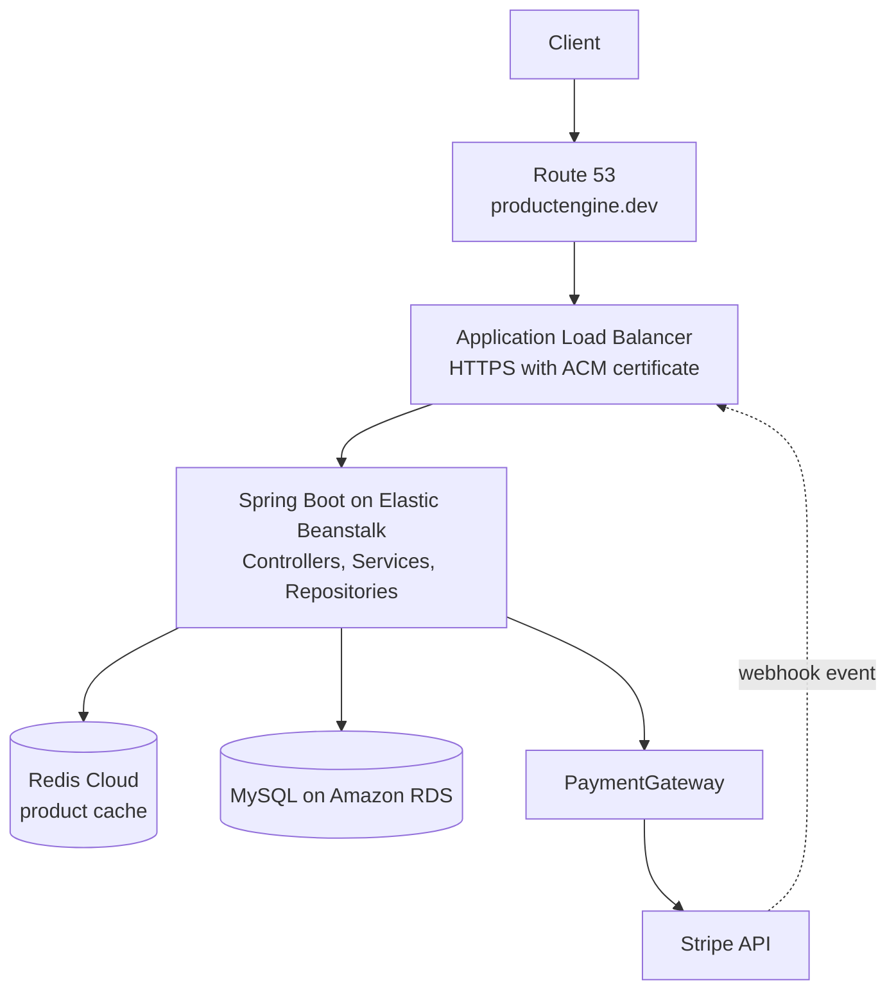
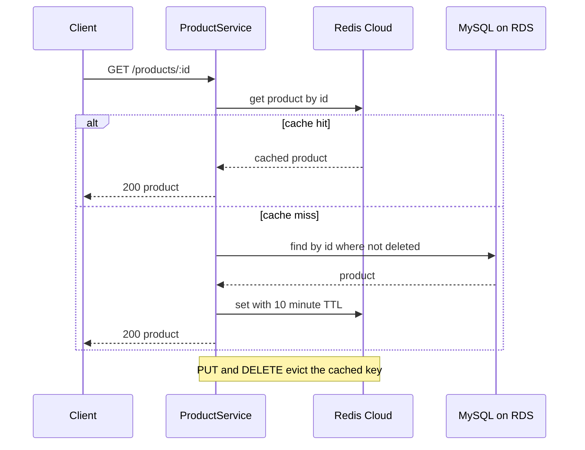
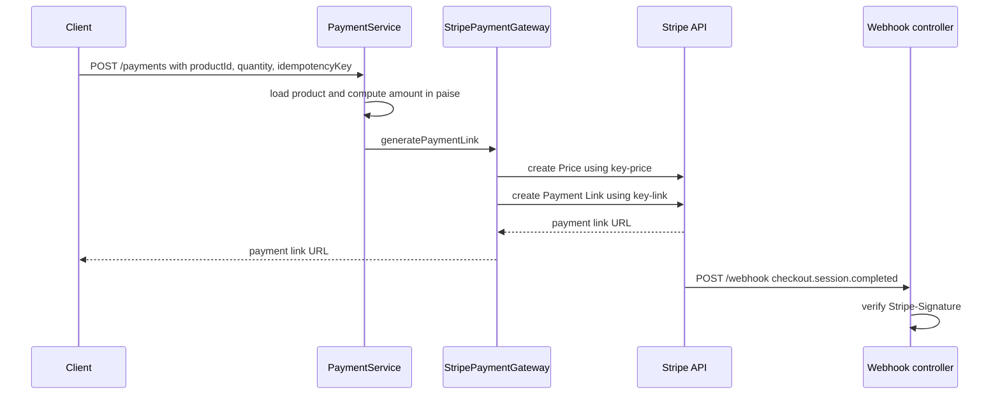

# Product Catalog & Payment Service


Backend service for an e-commerce catalog: product CRUD with soft delete, Redis cache-aside reads, paginated title search, and Stripe Payment Link creation with webhook signature verification. Deployed on AWS behind an Application Load Balancer with HTTPS, using Elastic Beanstalk, Amazon RDS (MySQL) and Redis Cloud.

**Live API:** https://productengine.dev/products

## Key results

| Area | Result |
|---|---|
| Read performance | Cache hits averaged **13 ms** (p95 15 ms) against **29 ms** (p95 31 ms) for database-backed reads, measured on the deployed API from AWS CloudShell in `ap-south-1` |
| Database load | 72 of 90 requests in the benchmark were served from Redis, **80% fewer database reads** |
| Deployment | Elastic Beanstalk, Application Load Balancer, HTTPS (ACM), Route 53 DNS, Amazon RDS, Redis Cloud |
| Payments | Stripe Payment Links with idempotency keys and signature-verified webhooks |
| Testing | 35 JUnit 5 + Mockito unit tests; full CRUD lifecycle validated on the deployed API |

## Try it live

```bash
# List products
curl https://productengine.dev/products

# Health check
curl https://productengine.dev/actuator/health
```

Demo deployment: Stripe runs in test mode.

## Technology

| Area | Technology |
|---|---|
| Language and framework | Java 21, Spring Boot 3.2.5, Spring Web |
| Persistence | Spring Data JPA, Hibernate, MySQL, Flyway migrations |
| Caching | Redis Cloud, Spring Data Redis |
| Payments | Stripe Java SDK (Payment Links, webhooks) |
| Cloud | AWS Elastic Beanstalk, Application Load Balancer, Route 53, ACM, Amazon RDS |
| Operations | Spring Boot Actuator health endpoint |
| Testing and build | JUnit 5, Mockito, Maven |

## Highlights

- **Deployed end to end on AWS:** Route 53 DNS, an Application Load Balancer terminating HTTPS with an ACM certificate, Elastic Beanstalk running the Spring Boot app, Amazon RDS for MySQL, and Redis Cloud, validated with a full production CRUD pass.
- **Redis cache-aside** on product-detail reads with a 10-minute TTL, and cache eviction on every update and delete (see [Caching Performance](#caching-performance)).
- **Idempotent payments:** the Stripe Price and Payment Link calls each use their own idempotency key, so a retried request does not create duplicates.
- **Server-side payment calculation:** Fetches the product's stored price, calculates the total using the requested quantity, and converts the amount to paise before creating a Stripe Payment Link.
- **Verified webhooks:** `POST /webhook` checks the `Stripe-Signature` header against the endpoint signing secret before trusting the event, and rejects bad signatures with `400`.
- **Versioned schema:** Flyway migrations own the schema, and Hibernate runs with `ddl-auto=validate` to check the entities against it at startup.
- **Soft delete:** deleted products keep their row, and every read path filters them out.
- **Swappable design:** `ProductService` and `PaymentGateway` are interfaces, so the data source and the payment provider can change without touching controllers or `PaymentService`.
- **Twelve-factor style config:** database, Redis and Stripe settings all come from environment variables.
- **Health check endpoint:** `GET /actuator/health` (Spring Boot Actuator) is the load balancer's health-check path, and it is the only Actuator endpoint exposed.

## Architecture



Controllers handle HTTP, services hold the logic, and repositories handle persistence. `ProductService` has two implementations: `DatabaseProductService` (used by the controller through `@Qualifier`) and `FakeStoreProductService` (reads from the public FakeStore API).

### Product read with Redis cache-aside



A product that does not exist or is soft-deleted raises `ProductNotFoundException`, which the global `@ControllerAdvice` turns into a `404` JSON response.

### Payment link and webhook



## Design decisions

| Decision | Why |
|---|---|
| Cache-aside with a 10-minute TTL | Serves repeat reads from Redis, and the TTL bounds how stale an entry can get. Update and delete evict the key. |
| Soft delete (`isDeleted`) | Keeps rows for history. Read paths filter out deleted products. |
| Flyway migrations + `ddl-auto=validate` | The schema is versioned in SQL; Hibernate checks that the entities match it at startup. |
| `PaymentGateway` interface | Payment providers can be added without changing `PaymentService`. Stripe is the implemented gateway. |
| Idempotency keys on Stripe calls | A retried request with the same key does not create a duplicate Price or Payment Link. |
| Environment-variable configuration | Database, Redis and Stripe credentials are configured outside the source code. |
| Actuator exposes only `health`, details hidden | The public health endpoint reports status without revealing internals. |
| RDS reachable only from the application's security group | The database is not exposed to the internet; only the application tier can connect on 3306. |

## API

| Method | Endpoint | Description | Success |
|---|---|---|---|
| `GET` | `/products` | List non-deleted products | `200` |
| `GET` | `/products/{id}` | Get a product (cached in Redis) | `200`, `404` if missing |
| `POST` | `/products` | Create a product | `201` |
| `PUT` | `/products/{id}` | Update a product | `200`, `404` if missing |
| `DELETE` | `/products/{id}` | Soft-delete a product | `204`, `404` if missing |
| `POST` | `/search` | Paginated product-title search, sorted by title ascending | `200` |
| `POST` | `/payments` | Create a Stripe Payment Link | `200` |
| `POST` | `/webhook` | Receive Stripe events and verify the signature | `200`, `400` if signature invalid |
| `GET` | `/actuator/health` | Health check used by the load balancer | `200` |

Example requests:

```bash
# Get a product
curl https://productengine.dev/products/1

# Create a product
curl -X POST https://productengine.dev/products \
  -H "Content-Type: application/json" \
  -d '{"title": "HP Pavilion", "description": "Gaming laptop", "image": "https://example.com/hp.png", "price": 150, "category": "Laptops"}'

# Search for titles matching "phone": page 0, 10 results
curl -X POST https://productengine.dev/search \
  -H "Content-Type: application/json" \
  -d '{"query": "phone", "pageNumber": 0, "pageSize": 10}'

# Request a payment link (Stripe test mode)
curl -X POST https://productengine.dev/payments \
  -H "Content-Type: application/json" \
  -d '{"productId": "1", "quantity": 2, "returnUrl": "https://example.com/thanks", "idempotencyKey": "order-1001"}'
```

Sample response for `GET /products/{id}`:

```json
{
  "id": 8,
  "createdAt": "2026-09-25T01:57:46.000+00:00",
  "updatedAt": "2026-09-25T01:57:46.000+00:00",
  "isDeleted": false,
  "title": "HP Pavilion",
  "description": "Gaming laptop",
  "price": 150.0,
  "imageUrl": "https://example.com/hp.png",
  "category": { "id": 4, "isDeleted": false, "name": "Laptops" }
}
```

## Caching Performance

### Local testing

An informal Postman test on a local setup took approximately **547 ms** for the first product-detail request after startup and approximately **30 ms** for subsequent requests once the product was cached in Redis.

### Deployed AWS benchmark

The deployed API was benchmarked with sequential `curl` requests from AWS CloudShell in the Mumbai region (`ap-south-1`) to the custom HTTPS domain, so every request passed through the Application Load Balancer.

- **Architecture:** Spring Boot on AWS Elastic Beanstalk, Application Load Balancer, Amazon RDS for MySQL, and Redis Cloud.
- **Workload:** product IDs 1 to 20 across five passes. Eighteen products returned HTTP 200; two soft-deleted products returned HTTP 404 and were excluded from the latency calculations.
- **Method:** Redis started with zero cached keys. The first pass exercised the database-backed cache-miss path, and the following four passes exercised the cache-hit path.
- **Metric:** time from the established TLS connection to the first response byte, taken from `curl` (`time_starttransfer` minus `time_appconnect`).
- **Successful requests analysed:** 90 (18 cache misses and 72 cache hits).

| Metric | Cache miss (database path) | Cache hit (Redis path) |
|---|---|---|
| Average response latency | 29 ms | 13 ms |
| p95 response latency | 31 ms | 15 ms |

Cache hits showed approximately **55% lower** average latency and **52% lower** p95 latency. 72 of the 90 requests (**80%**) were served without a database read; that share comes from the workload design, in which each product was requested five times. The test used one client sending sequential requests, measured from the client side.

## Production validation

The deployed API at `https://productengine.dev` was exercised end to end with Postman:

- `POST /products` returned `201`, `GET /products/{id}` returned the product, and `PUT /products/{id}` returned `200`. A following `GET` returned the updated values, confirming that the cache is evicted on update.
- `DELETE /products/{id}` returned `204`. A following `GET /products/{id}` returned `404`, and the deleted product no longer appeared in `GET /products`.
- `GET /products/999999` returned `404` with the JSON error body from the global `@ControllerAdvice`.
- `GET /actuator/health` returned `{"status":"UP"}` over HTTPS, and HTTPS was verified for both `productengine.dev` and `www.productengine.dev`.
- Redis Cloud showed active keys and operations during testing.
- The Stripe webhook endpoint is registered at `https://productengine.dev/webhook` and was tested in Stripe Sandbox (test mode).

## Testing

35 JUnit 5 and Mockito unit tests cover the controllers and services with mocked dependencies, so they run without MySQL, Redis or Stripe: cache hit and miss, cache eviction on update and delete, not-found handling, paginated search, payment amount calculation, and payment failure paths.

```bash
./mvnw test -Dtest='!ProductServiceApplicationTests'
```

`ProductServiceApplicationTests` holds the repository and context tests, which run separately against a live MySQL and Redis with sample data loaded.

## Project structure

```text
src/main/java/com/scaler/productservice
├── controllers      REST endpoints (Product, Search, Payment, Stripe webhook)
├── services         Business logic, ProductService and PaymentGateway implementations
├── repositories     Spring Data JPA repositories
├── models           JPA entities (Product, Category, BaseModel)
├── dtos             Request and error DTOs
├── advices          Global exception handling (@ControllerAdvice)
├── exceptions       Domain exceptions
└── configurations   Redis and RestTemplate configuration
src/main/resources
├── application.properties   Environment-variable based configuration
└── db/migration             Flyway versioned SQL migrations
```

## Run locally

**Prerequisites:** Java 21, a MySQL database, a Redis instance, and Stripe test-mode credentials.

Set these environment variables (read by `src/main/resources/application.properties`):

| Variable | Purpose |
|---|---|
| `DB_URL` | MySQL JDBC connection URL, e.g. `jdbc:mysql://localhost:3306/productservice` |
| `DB_USERNAME` / `DB_PASSWORD` | Database credentials |
| `REDIS_HOST` / `REDIS_PORT` / `REDIS_PASSWORD` | Redis connection |
| `STRIPE_API_KEY` | Stripe secret API key (test mode) |
| `STRIPE_WEBHOOK_SECRET` | Signing secret of the Stripe webhook endpoint |

Then start the app from the repository root. Flyway applies the migrations on startup, and the server listens on port `8080`.

```bash
./mvnw spring-boot:run        # Windows: .\mvnw.cmd spring-boot:run
```

For local webhook testing, run `stripe listen --forward-to localhost:8080/webhook` with the Stripe CLI and use the signing secret it prints.

## Deployment

The application is packaged as a Spring Boot JAR and runs on **AWS Elastic Beanstalk** (Corretto 21 on Amazon Linux 2023) behind an **Application Load Balancer**, with **Amazon RDS for MySQL** as the database and **Redis Cloud** as the managed cache.

- **Traffic path:** Client → Route 53 → Application Load Balancer → Spring Boot application on port 8080 → Amazon RDS for MySQL and Redis Cloud.
- **Elastic Beanstalk:** load-balanced web server environment, configured for 1 to 3 instances across two Availability Zones in `ap-south-1`. The load balancer health check uses `/actuator/health`.
- **HTTPS:** an AWS Certificate Manager certificate for `productengine.dev` and `www.productengine.dev` is attached to the load balancer's HTTPS (443) listener, and an HTTP (80) listener is also configured.
- **DNS:** the domain is registered with Name.com, and a Route 53 public hosted zone is authoritative, with alias A records for the root and `www` pointing to the load balancer.
- **Database:** Amazon RDS for MySQL (`db.t4g.micro`). Flyway creates the schema (`V1__init_schema.sql`, `V2__category_name_not_null.sql`) and Hibernate validates it with `ddl-auto=validate`.
- **Network path:** internet → load balancer (80 and 443) → application instances (8080) → RDS (3306, allowed only from the application's security group).
- **Configuration:** database, Redis and Stripe settings are Elastic Beanstalk environment properties, and no credentials are stored in the repository.
- **Stripe webhook:** `https://productengine.dev/webhook`, tested in Stripe Sandbox (test mode).

## Scope

A focused backend service covering the product catalog and the payment-link flow. The storefront, cart and order management, and user authentication are separate concerns outside this repository.
