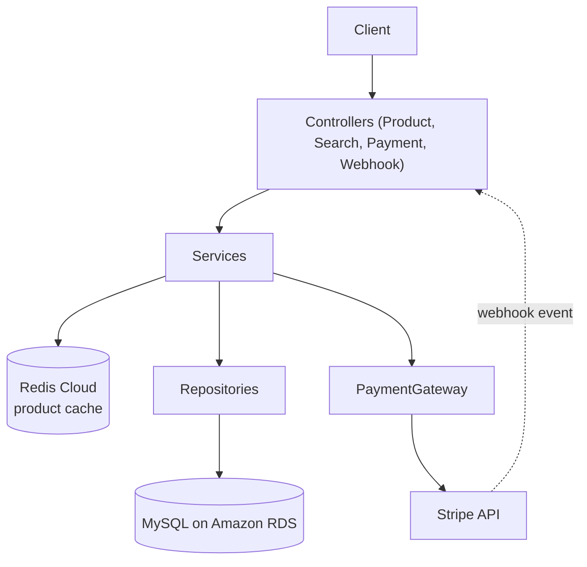
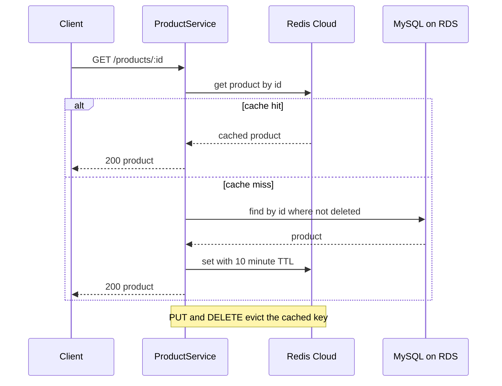
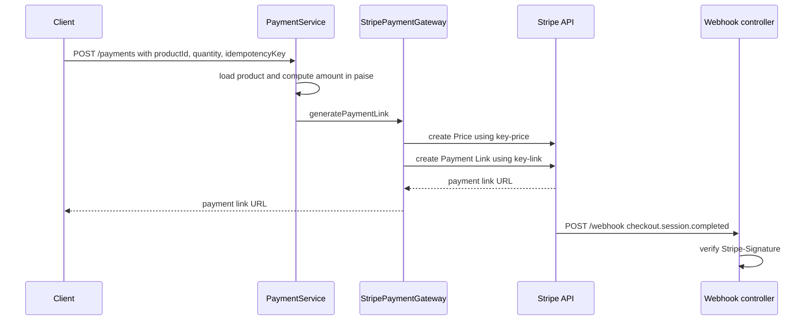

# Product Catalog & Payment Service

Backend service for an e-commerce catalog: product CRUD with soft delete, Redis cache-aside reads, paginated title search, and Stripe Payment Link creation with webhook signature verification. Deployed on AWS Elastic Beanstalk with Amazon RDS (MySQL) and Redis Cloud.

**Live API:** https://YOUR-EBS-URL/products

**Stack:** Java 21 · Spring Boot 3.2.5 · Spring Data JPA/Hibernate · MySQL (Amazon RDS) · Flyway · Redis Cloud · Stripe · JUnit 5 + Mockito · AWS Elastic Beanstalk

## Highlights

- **Redis cache-aside** on product-detail reads with a 10-minute TTL, and cache eviction on every update and delete.
- **Idempotent payments:** the Stripe Price and Payment Link calls each use their own idempotency key, so a retried request does not create duplicates.
- **Verified webhooks:** `POST /webhook` checks the `Stripe-Signature` header against the endpoint signing secret before trusting the event, and rejects bad signatures with `400`.
- **Versioned schema:** Flyway migrations own the schema, and Hibernate runs with `ddl-auto=validate` to check the entities against it at startup.
- **Soft delete:** deleted products keep their row, and every read path filters them out.
- **Swappable design:** `ProductService` and `PaymentGateway` are interfaces, so the data source and the payment provider can change without touching controllers or `PaymentService`.
- **35 unit tests** (JUnit 5 + Mockito) covering controllers and services.
- **Twelve-factor style config:** database, Redis and Stripe settings all come from environment variables.

## Architecture



Controllers handle HTTP, services hold the logic, and repositories handle persistence. `ProductService` has two implementations: `DatabaseProductService` (used by the controller through `@Qualifier`) and `FakeStoreProductService` (reads from the public FakeStore API).

### Product read with Redis cache-aside



A product that does not exist or is soft-deleted raises `ProductNotFoundException`, which the global `@ControllerAdvice` turns into a `404` JSON response.

### Payment link and webhook



## Design decisions

| Decision | Why |
|---|---|
| Cache-aside with a 10-minute TTL | Serves repeat reads from Redis, and the TTL bounds how stale an entry can get. Update and delete evict the key. |
| Soft delete (`isDeleted`) | Keeps rows for history. Read paths filter out deleted products. |
| Flyway migrations + `ddl-auto=validate` | The schema is versioned in SQL; Hibernate checks that the entities match it at startup. |
| `PaymentGateway` interface | Payment providers can be added without changing `PaymentService`. Stripe is the implemented gateway. |
| Idempotency keys on Stripe calls | A retried request with the same key does not create a duplicate Price or Payment Link. |
| Environment-variable configuration | Database, Redis and Stripe credentials are configured outside the source code. |

## API

| Method | Endpoint | Description | Success |
|---|---|---|---|
| `GET` | `/products` | List non-deleted products | `200` |
| `GET` | `/products/{id}` | Get a product (cached in Redis) | `200`, `404` if missing |
| `POST` | `/products` | Create a product | `201` |
| `PUT` | `/products/{id}` | Update a product | `200`, `404` if missing |
| `DELETE` | `/products/{id}` | Soft-delete a product | `204`, `404` if missing |
| `POST` | `/search` | Paginated product-title search, sorted by title ascending | `200` |
| `POST` | `/payments` | Create a Stripe Payment Link | `200` |
| `POST` | `/webhook` | Receive Stripe events and verify the signature | `200`, `400` if signature invalid |

Example requests:

```bash
# Get a product
curl https://YOUR-EBS-URL/products/1

# Create a product
curl -X POST https://YOUR-EBS-URL/products \
  -H "Content-Type: application/json" \
  -d '{"title": "HP Pavilion", "description": "Gaming laptop", "image": "https://example.com/hp.png", "price": 150, "category": "Laptops"}'

# Search for titles matching "phone": page 0, 10 results
curl -X POST https://YOUR-EBS-URL/search \
  -H "Content-Type: application/json" \
  -d '{"query": "phone", "pageNumber": 0, "pageSize": 10}'

# Request a payment link (Stripe test mode)
curl -X POST https://YOUR-EBS-URL/payments \
  -H "Content-Type: application/json" \
  -d '{"productId": "1", "quantity": 2, "returnUrl": "https://example.com/thanks", "idempotencyKey": "order-1001"}'
```

Sample response for `GET /products/{id}`:

```json
{
  "id": 8,
  "createdAt": "2026-09-25T01:57:46.000+00:00",
  "updatedAt": "2026-09-25T01:57:46.000+00:00",
  "isDeleted": false,
  "title": "HP Pavilion",
  "description": "Gaming laptop",
  "price": 150.0,
  "imageUrl": "https://example.com/hp.png",
  "category": { "id": 4, "isDeleted": false, "name": "Laptops" }
}
```

## Caching result

During manual local testing with Postman, a product-detail request took approximately 547 ms on the first request after startup and approximately 30 ms on subsequent requests after the product was cached in Redis. This is an observed local comparison, not a controlled benchmark or a guarantee of production response times.

## Testing

35 JUnit 5 and Mockito unit tests cover the controllers and services with mocked dependencies, so they run without MySQL, Redis or Stripe: cache hit and miss, cache eviction on update and delete, not-found handling, paginated search, payment amount calculation, and payment failure paths.

```bash
./mvnw test -Dtest='!ProductServiceApplicationTests'
```

`ProductServiceApplicationTests` is a separate set of context and repository tests that run against a live MySQL and Redis with sample data loaded, so the command above excludes it.

## Project structure

```text
src/main/java/com/scaler/productservice
├── controllers      REST endpoints (Product, Search, Payment, Stripe webhook)
├── services         Business logic, ProductService and PaymentGateway implementations
├── repositories     Spring Data JPA repositories
├── models           JPA entities (Product, Category, BaseModel)
├── dtos             Request and error DTOs
├── advices          Global exception handling (@ControllerAdvice)
├── exceptions       Domain exceptions
└── configurations   Redis and RestTemplate configuration
src/main/resources
├── application.properties   Environment-variable based configuration
└── db/migration             Flyway versioned SQL migrations
```

## Run locally

**Prerequisites:** Java 21, a MySQL database, a Redis instance (Redis Cloud free tier works), and Stripe test-mode credentials.

Set these environment variables (read by `src/main/resources/application.properties`):

| Variable | Purpose |
|---|---|
| `DB_URL` | MySQL JDBC connection URL, e.g. `jdbc:mysql://localhost:3306/productservice` |
| `DB_USERNAME` / `DB_PASSWORD` | Database credentials |
| `REDIS_HOST` / `REDIS_PORT` / `REDIS_PASSWORD` | Redis connection |
| `STRIPE_API_KEY` | Stripe secret API key (test mode) |
| `STRIPE_WEBHOOK_SECRET` | Signing secret of the Stripe webhook endpoint |

Then start the app from the repository root. Flyway applies the migrations on startup, and the server listens on port `8080`.

```bash
./mvnw spring-boot:run        # Windows: .\mvnw.cmd spring-boot:run
```

For local webhook testing, run `stripe listen --forward-to localhost:8080/webhook` with the Stripe CLI and use the signing secret it prints.

## Deployment

The application is packaged as a Spring Boot JAR and runs on **AWS Elastic Beanstalk**. It uses **Amazon RDS for MySQL** as the database (schema created by Flyway on startup) and **Redis Cloud** as the managed cache. The database, Redis and Stripe settings are provided as Elastic Beanstalk environment variables. The Stripe webhook endpoint points at `https://YOUR-EBS-URL/webhook`.

## Scope

This is a focused backend service covering the product catalog and payment-link flow. It is not a complete storefront or end-to-end order-management platform: cart, order management, authentication and a frontend are outside the current scope.
